

  <h1>🗺️ Daily Adventure</h1>
  
<i>Your daily reason to step outside, explore, and stay active.</i>

---

## 🌟 App Launch Previews

<table>
  <tr>
    <th align="center">Dark Mode</th>
    <th align="center">Light Mode</th>
  </tr>
  <tr>
    <td align="center">
      <video src="https://github.com/user-attachments/assets/f03a72ae-6367-45c0-a4fd-4de9a846947b" width="280" controls autoplay muted loop playsinline></video>
    </td>
    <td align="center">
      <video src="https://github.com/user-attachments/assets/5758d7c9-2ec4-406b-91ac-a231976c891f" width="280" controls autoplay muted loop playsinline></video>
    </td>
  </tr>
</table>

## 📸 Screenshots

<table>
  <tr>
    <th align="center">Dark Mode</th>
    <th align="center">Light Mode</th>
  </tr>
  <tr>
    <td align="center">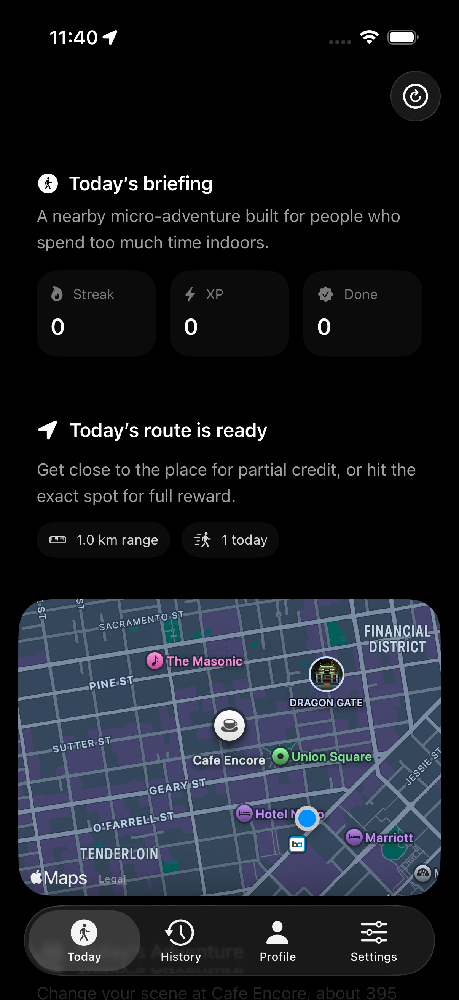 Home Screen</td>
    <td align="center">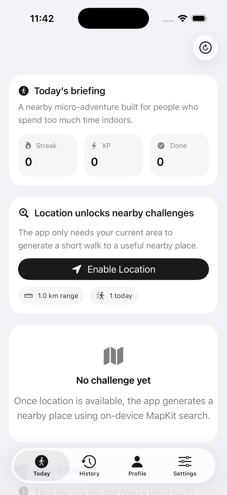 Home Screen</td>
  </tr>
  <tr>
    <td align="center">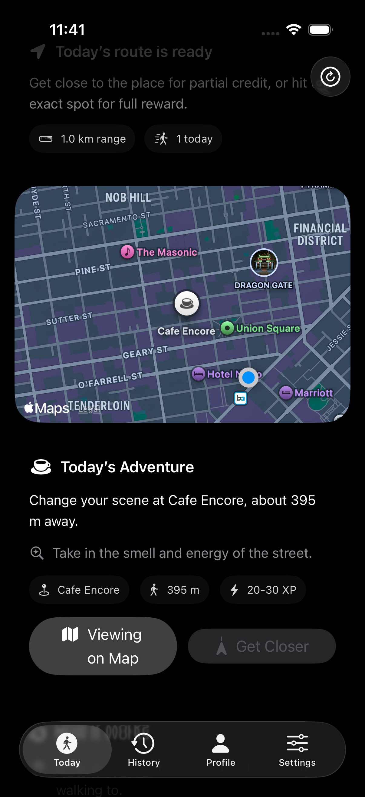 Map Detail</td>
    <td align="center">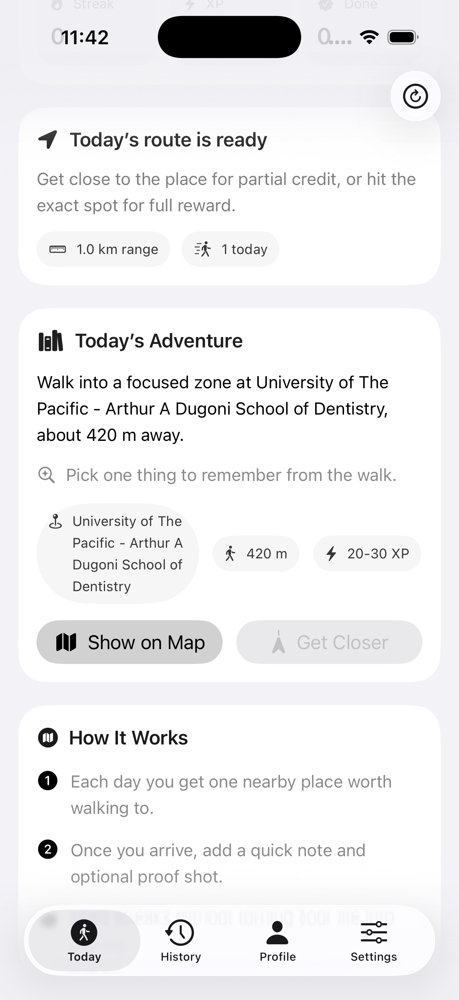 Map Detail</td>
  </tr>
  <tr>
    <td align="center">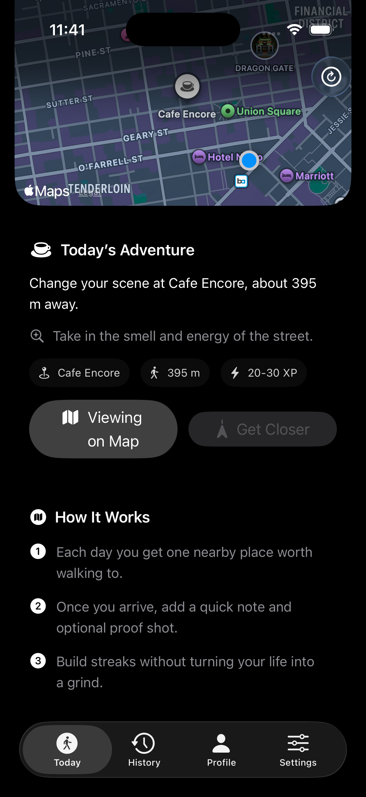 Active Challenge</td>
    <td align="center">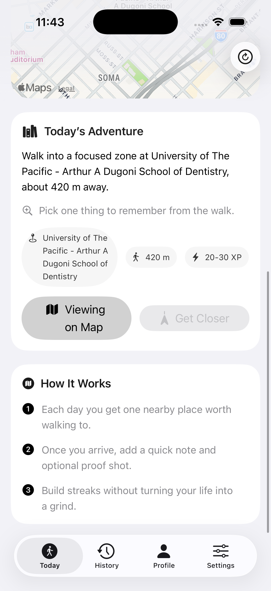 Active Challenge</td>
  </tr>
  <tr>
    <td align="center">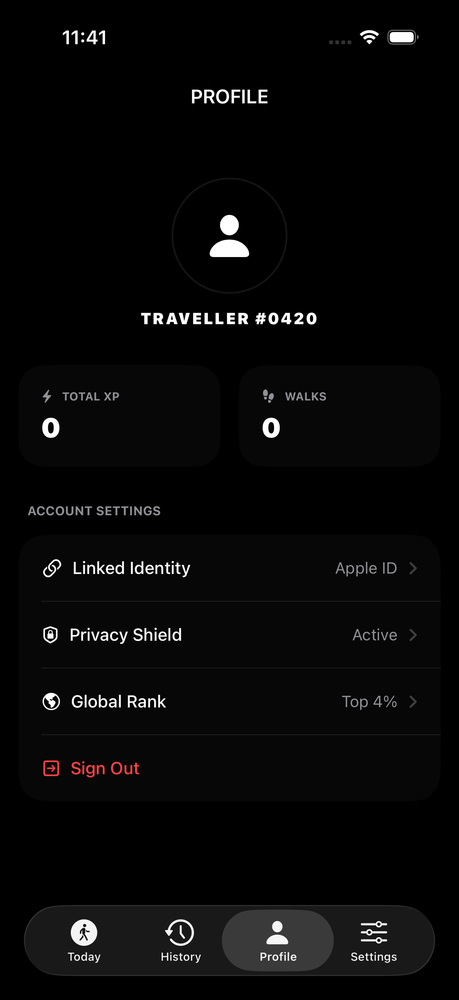 Profile</td>
    <td align="center">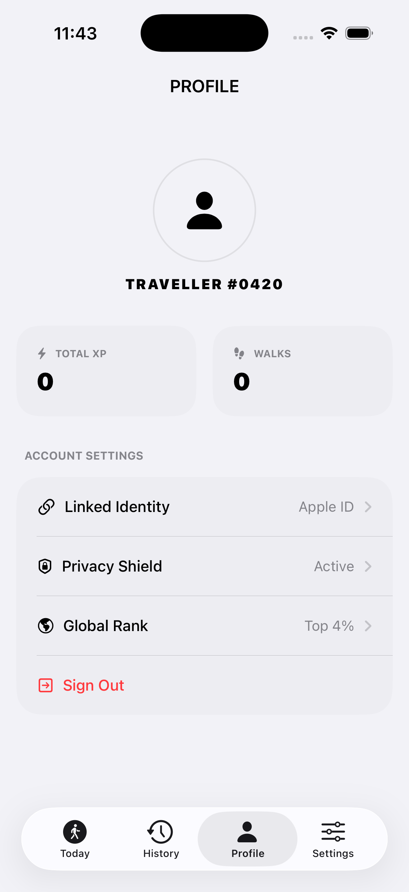 Profile</td>
  </tr>
  <tr>
    <td align="center">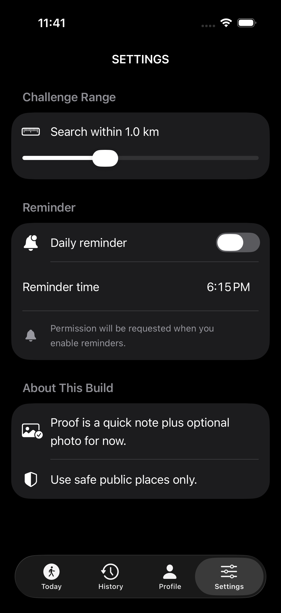 Settings</td>
    <td align="center">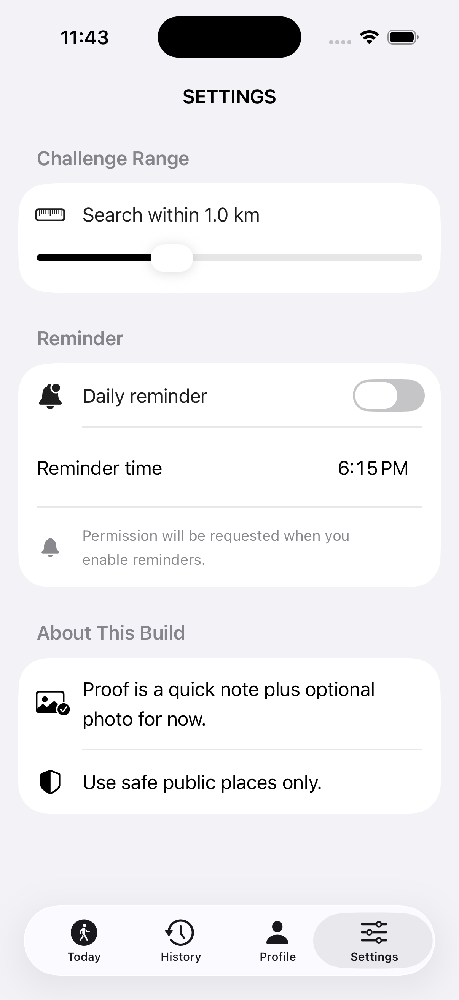 Settings</td>
  </tr>
  <tr>
    <td align="center"><i>N/A</i></td>
    <td align="center">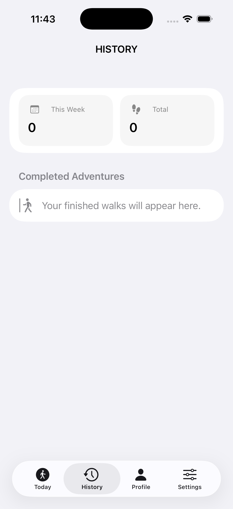 History</td>
  </tr>
  <tr>
    <td align="center"><i>N/A</i></td>
    <td align="center">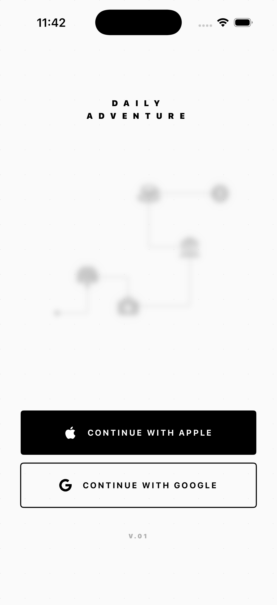 Login / Onboarding</td>
  </tr>
</table>

## 🌟 Overview

Daily Adventure is a location-based iOS application that encourages users to take daily walks and explore their surroundings. By generating daily challenges, the app motivates users to visit specific locations, earn experience points (XP), and maintain an active streak.

## ✨ Features

- **🎯 Daily Challenges:** Receive a new destination to visit every day.
- **📍 Location Verification:** Uses GPS to verify if you have reached the exact destination or are nearby.
- **🏆 Gamification:** Earn XP based on your proximity to the target (Exact vs. Nearby).
- **📸 Proof of Adventure:** Snap a photo and add a note to document your journey.
- **🔔 Daily Reminders:** Local notifications to remind you to step away from the screen and take your daily walk.

## 🏗️ Architecture

The app is built natively for iOS using modern frameworks:
- **UI:** SwiftUI
- **Persistence:** SwiftData
- **Location:** CoreLocation
- **Notifications:** UserNotifications

### Key Components
- **`DailyChallenge`**: The core SwiftData model representing a task, its location, and completion status.
- **`LocationManager`**: Handles CoreLocation logic, tracking user proximity to the challenge destination.
- **`ReminderManager`**: Schedules and manages daily local notifications.
- **`ProofPhotoStore`**: Manages the storage of photo evidence for completed challenges.
- **`ChallengeGenerator`**: Manages the procedural generation of new daily locations.

## 📱 Requirements

- iOS 17.0+
- Xcode 15.0+

## 📄 License

This project is for personal use and is not currently licensed for open-source distribution.
